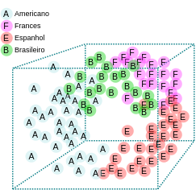

# Algoritmo KNN

  Algoritmo KNN e utilizado no aprendizado de maquina supervisionado, basicamente nesse Artigo vamos implementar esse algoritmo em um cenário de um restaurante internacional.

#### Montar o cenário

  Estamos em um ilustre restaurante Italiano dentro do Aeroporto Internacional John F. Kennedy na cidade de New York, nosso cliente possui um clientela internacional bastante variada sendo composta por Americanos, Brasileiros,  Espanhóis e Franceses. O nosso cliente deseja abrir uma filial, mas não sabe em qual nação seus Cardápio Italiano serão mais apreciados.

  Para auxilia lo nosso cliente te enviou as comandas de 5 dias de trabalho com a respectiva quantidade em gramas de Carne vermelha , Carne Banca , Massas, Frutas e Vegetais por pessoa.


Atenção nesse cenário existem varias variáveis  que precisamos considerar, mas não vamos abordar essas questões, para facilitar a implementação do algoritmo. Além é claro que nosso cliente poderia simplesmente perguntar ao cliente qual sua naturalidade.


  Como fonte dos hábitos alimentares dos Americanos, Brasileiros , Espanhóis e Franceses você utilizou um estudo da _International Scientific Institute of Biology and Agriculture_.

#### Comece bonitão! Go Horse!

  Tendo agora um arquivo com a media de consumo de cada nacionalidade em gramas e a quantidade consumida, construa um programa que leia o arquivo com as medias de cada nacionalidade e as comandas e faça o cruzamento dos dados devolvendo a nacionalidade com mais clientes.





  Esta na hora de produzir o código que usara a media do estudo e as comandas para através da distancia euclidiana definir a nacionalidade de cada cliente.

  Para ser mais abrangente em termos de linguagem eu farei o Script em Javascript, Python e JAVA, para assegurar que a maioria compreenda em sua linguagem mais familiar.

  Antes de procedermos saiba que as descrições podem estar um tanto complexas para falar a verdade, então não exite em pegar uma café e/ou ler uma 2° vez.

#### Função da Distancia Euclidiana

  Para pensar em distancia nos termos da distancia euclidiana, pense que a distancia de uma entidade para outra nada mais é do que o quanto as diferenças de uma entidade possui em relação a outra entidade.


Em desenvolvimento


