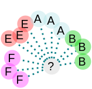
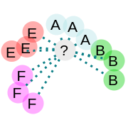
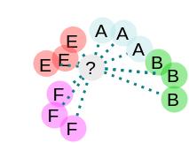
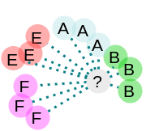
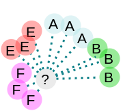

# Algoritmo KNN

  Algoritmo KNN é utilizado na aprendizagem supervisionada de maquina, basicamente nesse artigo vamos implementar esse algoritmo em um cenário de um restaurante internacional.

## Montar o cenário


  Estamos em um ilustre restaurante Italiano dentro do Aeroporto Internacional John F. Kennedy na cidade de New York, nosso cliente possui um clientela internacional bastante variada sendo composta por Americanos, Brasileiros, Espanhóis e Franceses. O nosso cliente deseja abrir uma filial, mas não sabe em qual nação seu Cardápio Italiano sera mais apreciado. Seu trabalho será identificar qual pais retem o maior numero de clientes.

  Para auxilia lo nosso cliente te enviou as comandas de 5 dias de trabalho com a respectiva quantidade em gramas de Carne vermelha , Carne Branca , Massas, Frutas e Vegetais consumidos por cliente.


Atenção nesse cenário existem varias variáveis que precisamos considerar, mas não vamos abordar essas questões, para facilitar a implementação do algoritmo. Além é claro que nosso cliente poderia simplesmente perguntar ao cliente qual sua nacionalidade.


  Como fonte dos hábitos alimentares dos Americanos, Brasileiros , Espanhóis e Franceses você utilizou um estudo da _International Scientific Institute of Biology and Agriculture_.

## Comece bonitão! Go Horse!

  Tendo agora um arquivo com a media de consumo de cada nacionalidade em gramas e a quantidade consumida por cliente, construa um programa que leia o arquivo com as medias de cada nacionalidade e as comandas e faça o cruzamento dos dados devolvendo a nacionalidade com mais clientes para ajudar nosso patrão a definir a filial.





  Esta na hora de produzir o código que usara a media do estudo e as comandas para através da distancia euclidiana definir a nacionalidade de cada cliente.

  Para ser mais abrangente em termos de linguagem eu farei o Algoritmo em Javascript, Python e JAVA, para assegurar que a maioria compreenda em sua linguagem mais familiar.

  Antes de procedermos saiba que as descrições podem estar um tanto complexas para falar a verdade, então não exite em pegar uma café e/ou ler uma 2° vez.

### Função da Distancia Euclidiana

  Para pensar em distancia nos termos da distancia euclidiana, pense que a distancia de uma entidade\(Cliente\) para outra nada mais é do que quantas diferenças uma entidade\(Cliente\) possui em relação a outra entidade\(Cliente\).

* Pegar a diferença entre as propriedades das entidades



```javascript
// Função que retorna a distancia euclidiana de 2 clientes
function getEuclidiana( cliente0 , cliente1){
    /*
        Distância euclidiana é a raiz quadrada da soma das
        diferenças dos valores dos atributos elevado ao quadrado
    */

    let soma = (cliente0.carnes_vermelhas - cliente1.carnes_vermelhas)** 2
             + (cliente0.carnes_brancas - cliente1.carnes_brancas)** 2
             + (cliente0.massas        - cliente1.massas        )** 2
             + (cliente0.frutas        - cliente1.frutas        )** 2
             + (cliente0.vegetais      - cliente1.vegetais      )** 2;

    return Math.sqrt(soma, 2); // ou soma ** (1/2);
}
```



```python
import math;

# Função que retorna a distancia euclidiana de 2 clientes
def getEuclidiana( cliente0 , cliente1 ):
  """
      Distância euclidiana é a raiz quadrada da soma das
     diferenças dos valores dos atributos elevado ao quadrado
  """
  soma =  (cliente0['carnes_vermelhas'] - cliente1['carnes_vermelhas'])**2
  soma += (cliente0['carnes_brancas'] - cliente1['carnes_brancas'])**2
  soma += (cliente0['massas'] - cliente1['massas'] )** 2
  soma += (cliente0['frutas'] - cliente1['frutas'] )** 2
  soma += (cliente0['vegetais'] - cliente1['vegetais'] )** 2

  return math.sqrt(soma, 2); # ou soma ** (1/2);
```



```java
public double getEuclidiana(Cliente cliente0 , Cliente cliente1){
 /*
      Distância euclidiana é a raiz quadrada da soma das
     diferenças dos valores dos atributos elevado ao quadrado
 */

 double soma = 0;
 soma+=Math.pow((cliente0.carnes_vermelhas - cliente1.carnes_vermelhas),2);
 soma +=Math.pow((cliente0.carnes_brancas   - cliente1.carnes_brancas), 2);
 soma +=Math.pow((cliente0.massas           - cliente1.massas        ), 2);
 soma +=Math.pow((cliente0.frutas           - cliente1.frutas        ), 2);
 soma +=Math.pow((cliente0.vegetais         - cliente1.vegetais      ), 2);

 return Math.sqrt(soma);
}
```



```cpp
double getEuclidiana(Cliente cliente0 , Cliente cliente1){
 /*
      Distância euclidiana é a raiz quadrada da soma das
     diferenças dos valores dos atributos elevado ao quadrado
 */

    double soma = 0;
    soma += pow((cliente0.getA() - cliente1.getA()), 2); 
    soma += pow((cliente0.getB() - cliente1.getB()), 2); 
    soma += pow((cliente0.getC() - cliente1.getC()), 2); 
    soma += pow((cliente0.getD() - cliente1.getD()), 2);


    return sqrt(soma);
}
```



  Primeiro vamos pegar o cliente A que é Americano e consumiu 10.00 g de carne vermelha e vamos pegar a diferença com o cliente B que consumiu 08.00 g de carne vermelha oque nos da:

| Carne Vermelha A | Carne Vermelha B | Diferença |
| :---: | :---: | :--- |
| 10.0 g | 08.0 g | 02.0 g |

* Elevar ao quadrado a diferença

  Agora com a diferença 2.0 g vamos elevar ao quadrado.

| Diferença | Quadrado |
| :---: | :---: |
| 02.0 g | 04.0 g |

* Somar as diferenças 

| Cliente | Carne vermelha | Carne Branca | Massas | Frutas | Vegetais |
| :---: | :---: | :---: | :---: | :---: | :---: |
| A | 10.00 g | 10.00 g | 07.24 | 03.50 | 02.10 |
| B | 08.00 g | 11.00 g | 06.24 | 03.64 | 03.00 |
| A  **-**  B | 02.00 g | -01.00 g | 01.00 | 00.14 | -00.90 |
| x**²** | 4.0 | 1.0 | 1.0 | 0.019 | 0.81 |

* Fazer a raiz quadrada


Para os Curiosos e entusiasmados por programação, a função de raiz na maioria das linguagens que eu conheço implementam uma função com nome de `sqrt( x, 2)` ao invés de `²√x` para as operações, então para evitar aprender a utilizar uma em cada linguagem eu sempre uso a potenciação: `x ** ( 1 / 2 )`  .

`sqrt( x, 2 ) == x ** ( 1 / 2 )` ou `sqrt( x, 3 ) == x ** ( 1 / 3 )`


| Carne vermelha | Carne Branca | Massas | Frutas | Vegetais | Soma | Raiz |
| :---: | :---: | :---: | :---: | :---: | :---: | :---: |
| 4.0 | 1.0 | 1.0 | 0.019 | 0.81 | 6,829 | 46.63 |

### Função da Classificação

  Dentro dessa função vamos comparar o cliente que precisa ser identificado com as pessoas que já sabemos a nacionalidade pelo estudo que consultamos.

 Depois criar uma vetor que indexe as relações de distancia entre as entidades cliente não identificadas\(Comanda\) para os clientes do estudo.

####   Pegando os dados

  Começamos lendo os dados nos dois arquivo e adicionando nas nossas listas. para isso vamos criar uma função para ler e montar os dados.



```javascript
function le_arquivo(nome){
   // Lista com os dados pegos linha por linha
   listDados = [];
   arquivo = fs.readFileSync(nome,'utf8').split('\n');
   for(let line of arquivo){
        // Corta o texto da linha para pegar cada dado
        carne_vermelha  = line.slice(4,9)   * 1;
        carne_branca    = line.slice(13,18) * 1;
        massa           = line.slice(22,27) * 1;
        fruta           = line.slice(31,36) * 1;
        vegetais        = line.slice(40,45) * 1;
        nascionalidade  = line.slice(50,57);
        // Monta o Cliente e adiciona na lista 
        listDados.push({  'carnes_vermelhas':carne_vermelha,
                            'carnes_brancas':carne_branca,
                            'massas':massa,
                            'frutas':fruta,
                            'vegetais':vegetais,
                            'nascionalidade':nascionalidade
                            });
   }
    // Retorna as informação guardadas na lista
    return listDados;
}
```



```python
def le_arquivo(nome):
    # Lista com os dados pegos linha por linha
    listDados = [];
    # Abre o arquivo para leitura 'r'
    with open( nome,'r') as arquivo:
        # Le o arquivo linah por linha
        for line in arquivo:
            # Corta o texto da linha para pegar cada dado
            carne_vermelha  = float(line[4:9]);
            carne_branca    = float(line[13:18]);
            massa           = float(line[22:27]);
            fruta           = float(line[31:36]);
            vegetais        = float(line[40:45]);
            nascionalidade  = line[50:57];
            # Monta o Cliente e adiciona na lista 
            listDados.append({  'carnes_vermelhas':carne_vermelha,
                                'carnes_brancas':carne_branca,
                                'massas':massa,
                                'frutas':fruta,
                                'vegetais':vegetais,
                                'nascionalidade':nascionalidade
                             });
        # Fecha o arquivo aberto
        arquivo.close();
    # Retorna as informação guardadas na lista
    return listDados;
```



```

```



```

```



  Agora que já podemos ler vamos pegar os dados do estudo que esta no arquivo de nome`mediaPorNasci.knn.algoritmo.txt` e os dados das comandas não identificadas no arquivo `comandas.knn.algoritmo.txt` , e começar a comparação.

  Vamos criar uma estrutura  de repetição que para pegar cada um dos clientes não identificas e  outro **loop** interno que se em carregara de comparar os dados do cliente não identificado com os dados do estudo.



```javascript
// Pegando os dados 
listClassificados   = le_arquivo('mediaPorNasci.knn.algoritmo.txt');
listNaoClassificados = le_arquivo('comandas.knn.algoritmo.txt');
console.log(listClassificados);
// Variaveis Acumuladoras de cada nacionalidade
qtdAmericanos = 0;
qtdEspanhol = 0;
qtdFrances = 0;
qtdBrasileiro = 0;

for(let clienteNaoIdentificado of listNaoClassificados){
    // Codigo para comparar e determinar a classe mais proxima
    for(let pessoaIdentificada of listClassificados){
        // Codigo que vai comparar o
        // ClienteNãoIdentificado com
        // cada um dos pessoaIdentificada no estudo 
    }
}
```



```python
# Pegando os dados 
listClassificados    = le_arquivo('mediaPorNasci.knn.algoritmo.txt');
listNaoClassificados = le_arquivo('comandas.knn.algoritmo.txt');
# Variaveis Acumuladoras de cada nacionalidade
qtdAmericanos = 0;
qtdEspanhol = 0;
qtdFrances = 0;
qtdBrasileiro = 0;

for clienteNaoIdentificado in listNaoClassificados:
    # Codigo para comparar e determinar a classe mais proxima
    for pessoaIdentificada in listClassificados:
        # Codigo que vai comparar o
        # ClienteNãoIdentificado com
        # cada um dos pessoaIdentificada no estudo 
        
```



  Para nos ajuda a entender vamos resumir nossas variáveis ate agora:

| **VARIÁVEL** | **DESCRIÇÃO** |
| :--- | :--- |
| **`listClassificados`** | Uma lista com as pessoas do estudo e suas medias de consumo de  Carne vermelha , Carne Branca , Massas, Frutas e Vegetais por refeição. |
| **`listNaoClassificados`** | Uma lista com os clientes das comandas e seu  consumo de  Carne vermelha , Carne Branca , Massas, Frutas e Vegetais. |
| **`clienteNaoIdentificado`** |  Cliente da comanda que ainda não foi definido de qual nacionalidade ele pertence! |
| **`pessoaIdentificada`** |   Pessoa do Estudo com a media de consumo por refeição e sua nacionalidade. |

  Bem agora que já pegamos cada `clienteNaoIdentificado`  e cada  `pessoaIdentificada` do estudo, vamos precisar comparar cada um dos `clienteNaoIdentificado` com todas as   `pessoaIdentificada` e guardar a distancia como mostrada nas imagens abaixo.



  Caso nosso `clienteNaoIdentificado` seja:

* Americano 



* Espanhol



* Brasileiro



* Frances



  

  Através da comparação com as pessoas já identificadas podemos extrapolar de qual nacionalidade  e o nosso cliente.

  Então vamos implementar criando uma lista chamada `listIndexadaPelaDistancia` que conterá a distancia que cada pessoas já identificada estão do cliente ainda não identificado. E depois vamos ordenar a lista para que tenhamos o mais próximo na 1° posição, o segundo na 2° posição e assim por diante deixando o  mais distante na ultima posição.



```python
for clienteNaoIdentificado in listNaoClassificados:
    # Lista que ira ordenarar as pessoa mais proximos dele 
    listIndexadaPelaDistancia = [];
    for pessoaIdentificada in listClassificados:
        # Comparando e pegando a distancia
        distancia = getEuclidiana(clienteNaoIdentificado,pessoaIdentificada)
        # Colocando na lista de ordenacao
        listIndexadaPelaDistancia.append({
                  'distancia':distancia,
                  'nascionalidade': pessoaIdentificada['nascionalidade']
                 });
```



Vamos ordenar a lista:



```javascript
// Hora de ordenar pelos com menor
// distancia
let funcaoDeOrdenacao = function(a, b){
    return a['distancia'] - b['distancia']
   }
// Usando o recurso de sort da linguagem
listIndexadaPelaDistancia.sort( funcaoDeOrdenacao );
```



```python
    // Hora de ordenar pelos com menor
    // distancia
    funcaoDeOrdenacao = function(a, b){ return a['distancia'] - b['distancia'] }
    // Usando o recurso de sort da linguagem
    listIndexadaPelaDistancia.sort( funcaoDeOrdenacao );
```



  Agora que já temos a relação entre **`clienteNaoIdentificado`** e todas as **`pessoaIdentificada`** , precisamos determinar o quão distante a gente vai considerar para classificação , ao seja, quais das **`pessoaIdentificada`** estão mais próximas para nos ajudar a classificar o **`clienteNaoIdentificado`** , eu decidi escolher os 7 primeiros da lista ordenada.



```javascript
K = 7;
for(let i of listIndexadaPelaDistancia.slice(0, K)){
    // Codigo que verifica qual nascionalidade é predominate
}
```



```python
    K = 7;
    for i in listIndexadaPelaDistancia[:K]:
        # Codigo que verifica qual nascionalidade é predominate
```



 Agora só falta contar a nacionalidade predominante nesse conjunto de 7 pessoas próximas e teremos nosso classificador.



```javascript
K = 7;
/*
   Escolhi 7, mas na minha opniao seria melhor
  pegar uma porcentagem dos classificados como 30% algo assim,
  quem sabe , afinal eu não sou um experti em algoritmos de 
  aprendizado supervisionado de maguina 
*/
isAmerica = 0;
isFrances = 0;
isEspanho = 0;
isBrasile = 0;
for(let i of listIndexadaPelaDistancia.slice(0, K)){
    // Codigo que verifica qual nascionalidade é predominate
    if (i['nascionalidade'] == "America")
        isAmerica += 1;
    else if(i['nascionalidade'] == "Espanho")
        isEspanho += 1;
    else if(i['nascionalidade'] == "Frances")
        isFrances += 1;
    else if(i['nascionalidade'] == "Brasile")
        isBrasile += 1;
    else console.log("Categoria não identificada");
}
```



```python
    K = 7;
    # Escolhi 7, mas na minha opniao seria melhor
    # pegar uma porcentagem dos classificados como 30% algo assim,
    # quem sabe , afinal eu não sou um experti em algoritmos de 
    # aprendizado supervisionado de maguina
    isAmerica = 0;
    isFrances = 0;
    isEspanho = 0;
    isBrasile = 0;
    for i in listIndexadaPelaDistancia[:K]:
        
        if i['nascionalidade'] == "America":
            isAmerica += 1;
        elif i['nascionalidade'] == "Espanho":
            isEspanho += 1;
        elif i['nascionalidade'] == "Frances":
            isFrances += 1;
        elif i['nascionalidade'] == "Brasile":
            isBrasile += 1;
        else:
            print("Categoria não identificada")
```



  Agora vamos verificar qual é a predominante verificando qual das variáveis acumuladoras e maior que as outras.



```javascript
categoriaDefinida = "Indefinida...";
// IFs apra verificar qual nacionalidade esta mais presente
if(isAmerica>isEspanho && isAmerica > isFrances && isAmerica> isBrasile)
{
    categoriaDefinida = "America";
    qtdAmericanos += 1;
}
else if(isEspanho>isAmerica && isEspanho>isFrances && isEspanho> isBrasile)
{
    categoriaDefinida = "Espanho";
    qtdEspanhol += 1;
}
else if(isFrances>isAmerica && isFrances>isEspanho && isFrances> isBrasile)
{
    categoriaDefinida = "Frances";
    qtdFrances += 1;
}
else if(isBrasile>isAmerica && isBrasile>isEspanho && isBrasile>isFrances)
{
    categoriaDefinida = "Brasile";
    qtdBrasileiro += 1;
}
```



```python

categoriaDefinida = "Indefinida...";
# IFs apra verificar qual nacionalidade esta mais presente
if isAmerica>isEspanho and isAmerica > isFrances and isAmerica> isBrasile:
    categoriaDefinida = "America";
    qtdAmericanos += 1;
elif isEspanho>isAmerica and isEspanho>isFrances and isEspanho> isBrasile:
    categoriaDefinida = "Espanho";
    qtdEspanhol += 1;
elif isFrances>isAmerica and isFrances>isEspanho and isFrances> isBrasile:
    categoriaDefinida = "Frances";
    qtdFrances += 1;
elif isBrasile>isAmerica and isBrasile>isEspanho and isBrasile>isFrances:
    categoriaDefinida = "Brasile";
    qtdBrasileiro += 1;

print("Categoria Definida   :%s "%categoriaDefinida)
print("Categoria Verdadeira :%s "%clienteNaoIdentificado['nascionalidade'])
```



  Agora só falta mostrar quantos clientes cada nacionalidade possui:



```javascript
listClassificados   = le_arquivo('mediaPorNasci.knn.algoritmo.txt');
listNaoClassificados = le_arquivo('comandas.knn.algoritmo.txt');

qtdAmericanos = 0;
qtdEspanhol = 0;
qtdFrances = 0;
qtdBrasileiro = 0;

for(let clienteNaoIdentificado of listNaoClassificados){
    // Codigo da classificação
    // ~~~~~~~~
    for(let pessoaIdentificada of listClassificados){
        // Codigo para pegar a distancia
        // ~~~~~~~~
    }
    // ~~~~~~~~
}
console.log(" Nacionalidade dos clientes :")
console.log(" Americanos %i ", qtdAmericanos);
console.log(" Espanhois %i ", qtdEspanhol);
console.log(" Franceses %i ", qtdFrances);
console.log(" Brasileiros %i ", qtdBrasileiro);
```



```python
# Fluxo principal

listClassificados   = le_arquivo('mediaPorNasci.knn.algoritmo.txt');
listNaoClassificados = le_arquivo('comandas.knn.algoritmo.txt');
qtdAmericanos = 0;
qtdEspanhol = 0;
qtdFrances = 0;
qtdBrasileiro = 0;
for clienteNaoIdentificado in listNaoClassificados:
    # Codigo da classificação
    # ~~~~~~~~
    for pessoaIdentificada in listClassificados:
        # Codigo para pegar a distancia
        # ~~~~~~~~
    # ~~~~~~~~
print(" Nacionalidade dos clientes :")
print(" Americanos %i " % qtdAmericanos);
print(" Espanhois %i " % qtdEspanhol);
print(" Franceses %i " % qtdFrances);
print(" Brasileiros %i " % qtdBrasileiro);
```



  Vou deixar o código para download:






