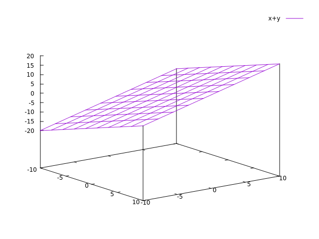

# Pseudo Aleatoriedade

### Oque é Pseudo Aleatoriedade

### Por que é importante? Segurança

  Dentro de uma aplicação e extremamente comum usamos identificadores para separar usuários e separar qual cliente\(Computador\) esta logado e usando qual recurso. Para isso e normal usarmos tokens \(Código de Identificação\) ou as mais antigas SessionID\( Código de Identificação de sessão\). 

  Mas o problema é que ambos são códigos gerados por um algoritmo no computador, logo se alguém calcula-se de quanto em quanto os códigos gerados pulam, seria possível um invasor   [extrapolar](https://www.dicio.com.br/extrapolar/) os próximos códigos e se passar por um cliente autenticado , isso foi chamado de [Sequestro de Sessão](https://en.wikipedia.org/wiki/Session_hijacking)  para tentar impedir isso nós sempre usamos e aprimoramos algoritmos não determinísticos para estabelecer um grau de entropia que dificulte previsões.

  O **algoritmo não determinístico** é um algoritmo cujo as entradas não determinam a saída final do programa por exemplo se eu somar `x + y`  aonde `x = 3` e `y = 4` o resultado será `x + y = 7` , mas e se eu somar `(x + DiaAtual) + (y + HoraAtual)`  aonde `x = 3`  e`y = 4`  o resultado vai variar de hora em hora e de dia em dia não importando qual será a minha entrada em `x` e `y`.

#### Implementação do UUID v4 


Em desenvolvimento


