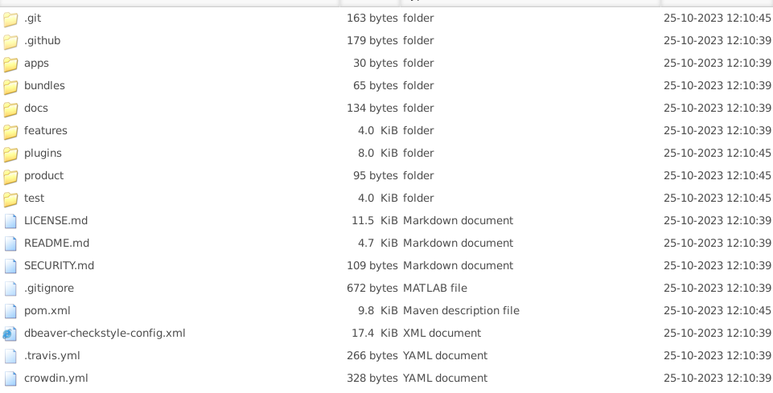
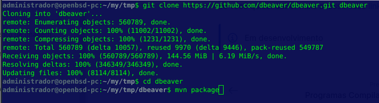
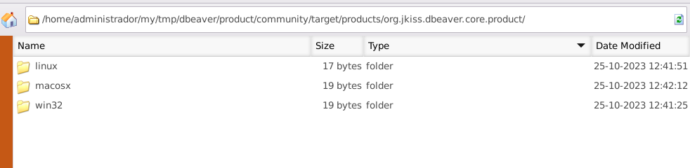

# DBeaver

DBeaver é um programa feito em java que utiliza a JPA e jdbc para conectar em diversos bancos de dados como MySQL, Postgress, SQL Server, ORACLE e etc.

Para começar precisaremos do código fonte, para isso vamos clonar o repositório:

```
$ git clone https://github.com/dbeaver/dbeaver.git dbeaver
$ cd dbeaver
```

Na pasta você deve ver algo como isso na pasta:

<figure><figcaption></figcaption></figure>

Para gerar os executaveis rode `mvn package`:

```bash
$ mvn package
```

<figure><figcaption><p>Download sources and build</p></figcaption></figure>

Depois disso as releases estarão em `/product/community/target/products/org.jkiss.dbeaver.core.product/`, dentro da pasta terá um compila do para Linux, MacOS e Windows.

<figure><figcaption><p>/product/community/target/products/org.jkiss.dbeaver.core.product/</p></figcaption></figure>

Mas como o executável para cada plataforma não é um jar? Ao invés de um arquivo binário executável para cada plataforma, na realidade o DBeaver se utilizou do `tycho` usado pelo eclipse se você quiser saber mais acesse esse [link](https://projects.eclipse.org/projects/technology.tycho).
