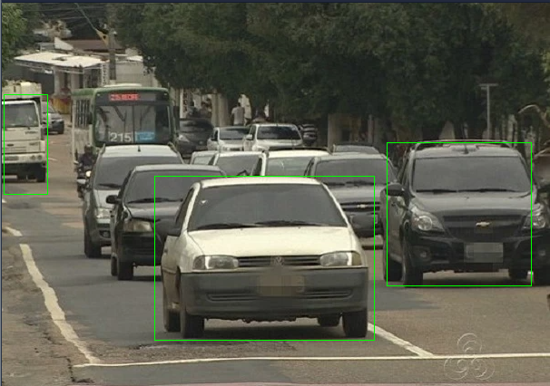

# OpenCV

O OpenCV oferece ferramentas e funções para tarefas como detecção de objetos, reconhecimento de padrões, manipulação de imagens e etc.

<figure><figcaption></figcaption></figure>


Em desenvolvimento

