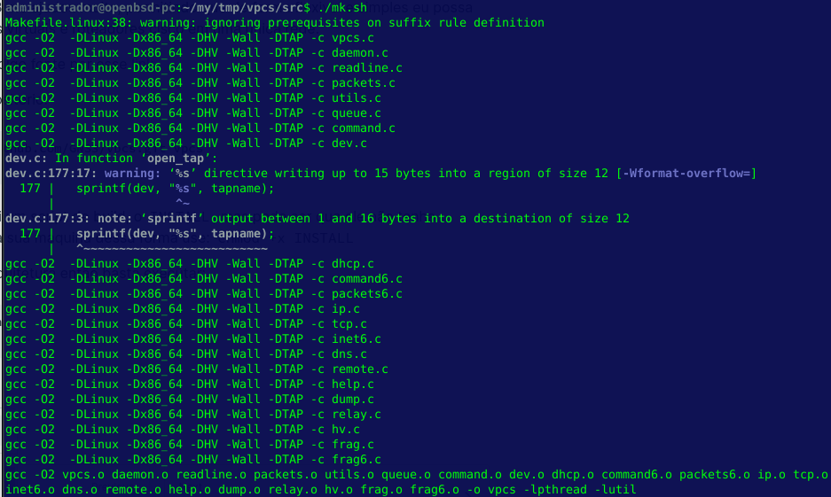
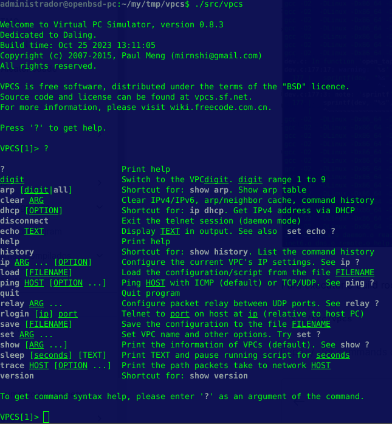

# VPCS

Bem tive contado com o VPCS quando instalei pela primeira vez o GNS3 na época eu era um estudante de redes de computadores no ITB e me concentrava integramente ao dimensionamento de redes e seus serviços.

Naquele momento o GNS3 me ajudou muito, permitindo que de forma flexivel e simples eu possa testar as minhas maquinas virtuais e roteadores cisco em uma unica rede.

Você pode encontrar o codigo fonte por esse [link](https://github.com/GNS3/vpcs).

Então vamos clonar o repositorio:

```sh
$ git clone https://github.com/GNS3/vpcs.git vpcs
$ cd vpcs
```

O vpcs do GNS3, já possui um script de build, o `./src/mk.sh`, mas pode ser que ele não tenha permissão de execução na sua maquina dessa forma use: `chmod +x ./src/mk.sh`

O script já reconhece a arquitetura então execute:

```
$ ./src/mk.sh 
```

<figure><figcaption></figcaption></figure>

Para executa o simulador de VPCS, execute:

```
$ ./src/vpcs
```

<figure><figcaption></figcaption></figure>

