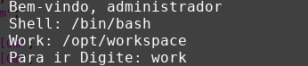
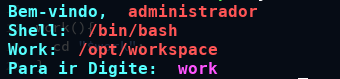

# Script

As aplicações muitas vezes vão precisar executar operações que não estão relacionadas com a logica de negocio de seus cliente, mas com a propria funcionamento da aplicação como backup, limpeza de logs e remoção de arquivos como imagens não mais utilizadas.

## Para solucionar isso?

Alguns desenvolvedores preferem usar suas línguas nativas como javascript, java, php e etc, para criar as rotinas necessárias, mas como sou um usuário de Debian e Manjaro prefiro utilizar o Bash, pois ele já possui um serie de ferramentas já implementadas dentro do sistema operacional, além de ser bem mais fácil e rápido codificar programas que operem com scripts.

### Montando o cenário

Você é um programador Nodejs recém saído do curso técnico, na sua primeira empresa, depois de muitos dias de testes e cruds que você fez para sua nova empresa, chega o dia em que só tem você para subir suas alterações para produção.

Nesse momento o responsável pela qualidade e o sênior permitem você subir em produção é te enviam a chave ssh para a conexão, depois de se conetar você se pergunta aonde esta o diretório de produção? O sênior lé diz que fica em `/opt/workspace` . imediatamente você entra no diretório e da os famosos `git pull origin master` e executa `nodemon ou pm` para reiniciar a aplicação.

### Ideia

Pensando sobre isso, antes de dormir você pensa como teria sido mais eficiente se assim que você entra se aparece se uma mensagem dizendo aonde esta o diretório da aplicação.

## Implementação

Primeiro vamos criar um arquivo, chamado `MyScript` que conterá a mensagem do dia\( Só os fortes entenderão\).

```bash
~$ touch ~/MyScript
```

Depois vamos escrever `#!/bin/bash` para dizer qual será o nosso interpretador, ficando assim:



```bash
~$ echo "#!/bin/bash" >> ~/MyScript
```



```bash
#!/bin/bash
```



Agora que temos o nosso script, vamos colocar a nossa mensagem.

```bash
#!/bin/bash
#  Diretorio de trabalho
work="/opt/workspace";
# Menssagem do dia kkkk
echo " Bem-vindo, $USER ";
echo " Shell: $SHELL ";
echo " Work: $work ";
echo " Para ir Digite: work ";

work(){
  cd "$work";
}
```

Bem agora só falta garantir que esse script seja executado ao entrar, para isso vamos editar o arquivo `/home/usuario/.bashrc` que é executado ao entrar em um instancia do Bash e criar um backup antes da alteração.

```bash
~$ cp ~/.bashrc ~/.bashrc.bkp
```

Agora vamos dizer para vincular o nosso script ao arquivo de inicialização do Bash.

```bash
~$ echo "source ~/MyScript" >> ~/.bashrc
```

Agora, na próxima vez que o usuário entrar ele verá:



Mas esta meio feio, não que isso seja importante, mas se o nosso usuário não ler ou não prestar atenção no que é importante como o comando work, isso não vai servir para nada.

Então para resolver isso vamos colorir a nossa mensagem deixando :

| Tipo | Cor | Hex |
| :--- | :--- | :--- |
| Texto Normal Explicativo | Azul bebé | \e\[1;36m &lt;TEXTO&gt; \e\[0m |
| Texto Com informações | Roxo Claro | \e\[1;31m &lt;TEXTO&gt; \e\[0m |
| Comandos | Vermelho | \e\[1;35m &lt;TEXTO&gt; \e\[0m |

Bem agora que já temos o nosso estilo, vamos utilizar `echo -e` para indicar o comando `echo` que ele deve permitir uso de cores e utilizar o `\e[<{tipoTexto}> ; <{COR}>m <{Texto}> \e[0m` , para saber mais sobre as cores utilize esse link do blog do [remontinho](https://blog.remontti.com.br/141) e do [vivaoLinux](https://www.vivaolinux.com.br/artigo/Formatando-o-bash-com-cores-e-efeitos).

Como resultado o nosso script `~/MyScript` fica assim:

```bash
#!/bin/bash

# Variaveis de trabalho
#work="$HOME/Área de trabalho/My/";
work="/opt/workspace";
#Variaveis formatadas de informacoes
terminal="\e[1;31m $SHELL\e[0m";
usuario="\e[1;31m $USER\e[0m";
workspace="\e[1;31m $work\e[0m";
# Nome dos Comandos formatados
comandowork="\e[1;35m work \e[0m";
# Menssagem do dia kkkk
echo -e "\e[1;36m Bem-vindo, $usuario \e[0m";
echo -e "\e[1;36m Shell: $terminal \e[0m";
echo -e "\e[1;36m Work: $workspace \e[0m";
echo -e "\e[1;36m Para ir Digite: $comandowork \e[0m";

work(){
  cd "$work";
}
```

Ao final nosso usuário ao entrar no servidor verá a mensagem da seguinte forma:



Dessa maneira caso o nosso usuário não queira ler todas as instruções, por causa da cor diferente a palavra work irá atrair a atenção, além é claro de saber agora aonde esta o diretório de trabalho da aplicação.

